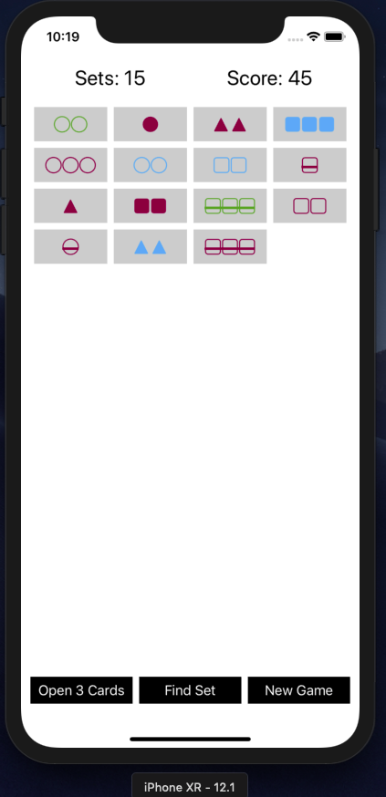

#  Set Card Game
> This project is about the popular set card game.

[![Swift Version][swift-image]][swift-url]
[![Build Status][travis-image]][travis-url]
[![License][license-image]][license-url]

## Features

- [x] Get the set card game working
- [x] Open 3 new cards button
- [x] New game button
- [x] Find set button
- [x] Selected cards animation
- [x] Score count label
- [x] Set count label

## Requirements

- iOS 11.4+
- Xcode 9.4

## Version

1.0

## Installation

Set Card Game requires [iOS 11.4+](https://developer.apple.com/ios/) also requires[Xcode 9.4](https://developer.apple.com/xcode/) and [swift](https://developer.apple.com/swift/) to run.

Download zip file and extract it [latest pre-built release](https://github.com/reysmerwvr/SetCardGame). Or clone the repository and open it using Xcode.

Run the project. (Supported devices: iPhone X - iPhone 8 both in portrait mode)

## Contribute

We would love you for the contribution to **Set Card Game**, check the ``LICENSE`` file for more info.

## Todos

- [] Write tests
- []  Add code comments
- []  Support more devices
- []  Support landscape mode

## Meta

Reysmer Valle – [@ReysmerWVR](http://twitter.com/ValleReysmer)

## License

Set Card Game is (c) 2018 Reysmer Valle ([@ValleReysmer]) and may be freely distributed under the [license-url]. See the `MIT-LICENSE` file.

[swift-image]:https://img.shields.io/badge/swift-4.0-orange.svg
[swift-url]: https://swift.org/
[license-image]: https://img.shields.io/badge/License-MIT-blue.svg
[license-url]: https://github.com/reysmerwvr/SetCardGame/tree/master/LICENSE.md
[travis-image]: https://img.shields.io/travis/dbader/node-datadog-metrics/master.svg?style=flat-square
[travis-url]: https://travis-ci.org/dbader/node-datadog-metrics

